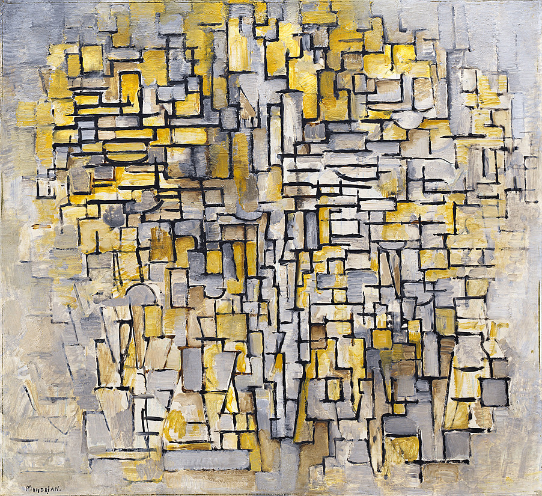

# AdaIN_Style_in_Pytorch_From_Scratch
This is an unofficial PyTorch implementation of [Arbitrary Style Transfer in Real-time with 
Adaptive Instance Normalization [Huang, Belongie ICCV2017]](https://arxiv.org/abs/1703.06868).
Original implementation in lua can be found [here](https://github.com/xunhuang1995/AdaIN-style).


This repository provides a pre-trained model for you to stylize your own image.
You can either download the training dataset or prepare your own dataset to train the model from scratch.

## Requirements
To install all required packages, run the following 
```
$ pip install -r requirements.txt
```

Required:
* Python 3.6+
* [pytorch](https://pytorch.org)
* [torchvision](https://pytorch.org)
* Pillow
* numpy

Optional (for training):
* tqdm

## Test

1. Clone this repository  ```$ git clone  ```

2. Prepare your own images. For convenience, I already provided some images in `content` and `style` folders
for you to try.

3. To generate an image, run ```test.py ```. Here are some basic usage:

```
Usage: test.py  [--h HELP]
                [--content CONTENT.JPG] 
                [--style STYLE.JPG]
                [--model MODEL_PATH]
                [--output OUTPUT_DIRECTORY] 
                [--alpha STYLIZATION_FACTOR] 
```
Some other options:
* `--crop`: Center crop both content and style images beforehand.
* `--ext`: Extension name for the output image.
* `--preserve-color`: To preserve the color of the content image

To see all available options, type the following command:
```
$ python test.py --help 
```
For instance, to transfer an image from a trained model ```models/adain_model.pth``` with ```content/content.jpg``` and ```style/style.jpg```,
you can type:
```
$ python test.py \
>    --model models/adain_model.pth \
>    --content content/content.jpg \
>    --style style/style.jpg
```
   
## Train

1. Download the content dataset [COCO](http://cocodataset.org/#download) and the style dataset [Wikiart](https://www.kaggle.com/c/painter-by-numbers),
unzip them, and rename them as `content` and `style` respectively.

2. Train the model with `train.py`. Here are some usage:

```
usage: train.py [--h HELP] 
                [--continual <.pth>] 
                [--continual ENABLE_CONTINUAL_TRAINING] 
                [--save_dir PATH_TO_SAVE_MODEL] 
                [--log_dir PATH_TO_SAVE_LOGS] 
                [--log_image_every INT] 
                [--save_interval INT] 
                [--cuda ENABLE_GPU] 
                [--n-threads INT] 
```
Hyper parameters:
```
Usage: train.py [--learning_rate] 
                [--learning_rate_decay ENABLE_DECAY_LEARNING_RATE]
                [--max_iter MAX_NUMBER_ITERATION] 
                [--batch_size INT] 
                [--content_weight FLOAT] 
                [--style_weight FLOAT]
```

For instance, to train model with ```COCO``` as content and ```wikiart``` as style, type:
```
$ python train.py \
>   --content-dir content \
>   --style-dir style
```
To check saved logs, simply type ```tensorboard --log_dir logs ```

For more, type the following command:
```
$ python train.py --help 
```

## Result
The following are some results.

| Original | Style | Output |
| ------------- | ------------- | -------------  |
|  |  |  |
| |  | |
| |  | |


## References
* [1]: X. Huang and S. Belongie. "[Arbitrary Style Transfer in Real-time with Adaptive Instance Normalization](https://arxiv.org/abs/1703.06868)", in ICCV, 2017.
* [2]: [Pytorch AdaIN](https://github.com/naoto0804/pytorch-AdaIN)
* [3]: [Image Style Transfer in AdaIN](https://github.com/SerialLain3170/ImageStyleTransfer/tree/master/AdaIN)
* [4]: [COCO Dataset](http://cocodataset.org/#download)
* [5]: [Wikiart dataset](https://github.com/cs-chan/ArtGAN/tree/master/WikiArt%20Dataset)